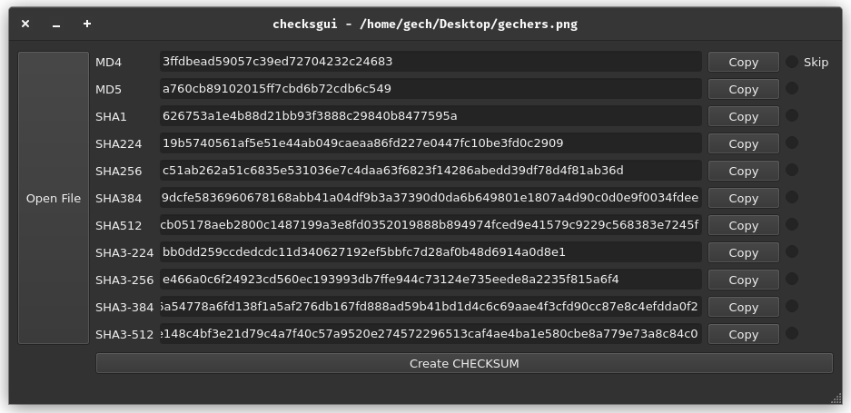

# [checks](https://github.com/ferhatgec/checks)gui
## simple qt application to get checksum of file

### checksgui licensed under the terms of MIT License which is compatible with QT's LGPLv3 license.
